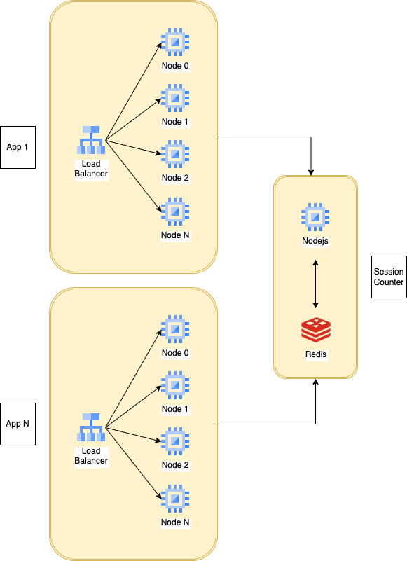
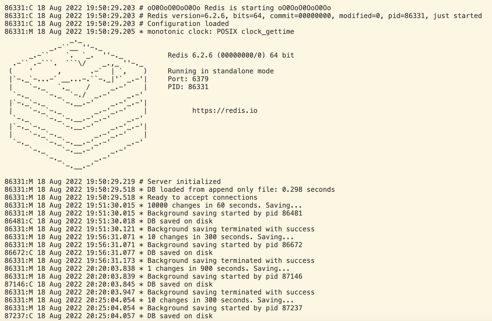
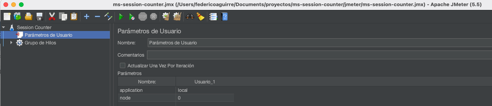
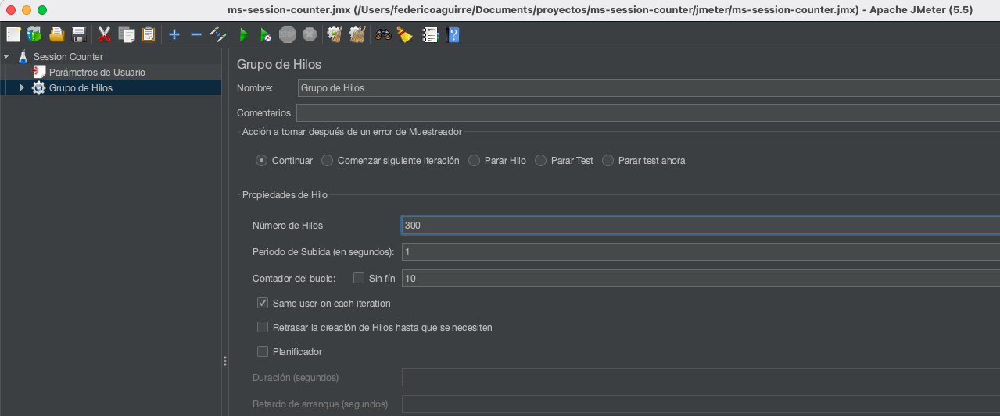
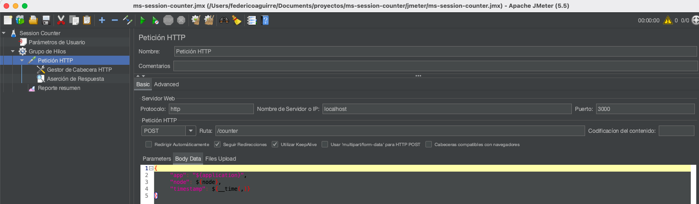
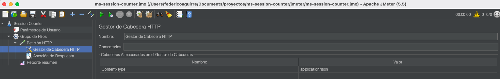
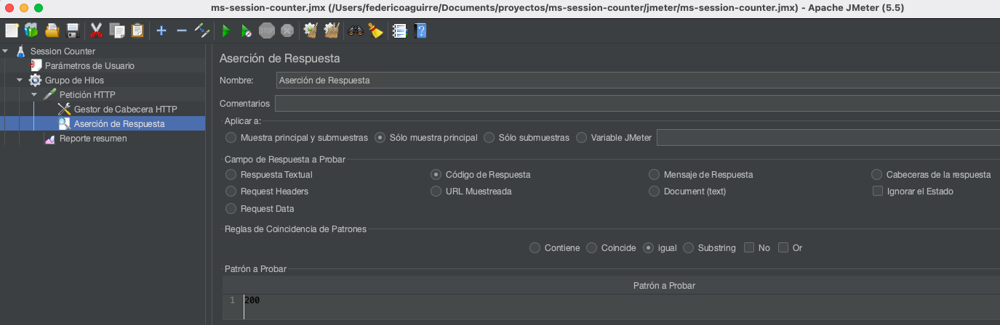
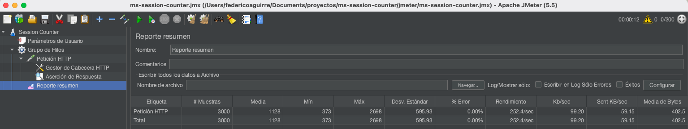

# ms-session-counter

This is a **Redis + Nodejs** backend microservice used for counting sessions from another apps.

It can keep the session count by application, node and day (and hours). Very useful for realtime dashboards.

It is a REST API which has 3  methods:
1. **/counter** (POST) method. It receives the application, node and timestamp of a new session and increases the hourly and daily counts.
2. **/kpi** (GET) method. It retrieves the hourly and daily counters of a particular application, node and date.
3. **/home** (GET) method. It checks the microservice and Redis status doing a PING command and sending back an OK response.
<!--TODO.
4. **/kpi** (GET) method (hour or day options). Get specific, hout or day counter.
5. **/dashboard** (GET) method. Shows a realtime  dashboard which updates every 100 ms.
-->

## Session counter architecture



## Redis log



## How it works

### How the data is stored:

Counters are stored in [**Redis Hashes**](https://redis.io/docs/data-types/hashes/). It has the benefit of saving a whole day of session counts, having a small footprint and at the same time be able to get a whole day of data in one single record.

**Session counter (Hash) definition**

<a name="key"></a>The **key** has the format:

```kpi:sessions:app:{application}:node:{nodeNumber}:day:{YYYYMMDD}```

Key composition follows [Redis suggestions](https://redis.com/blog/5-key-takeaways-for-developing-with-redis/).

| Prefix | Value |
|-|-|
| kpi | sessions - string (fixed value) |
| app | Application name - string |
| node | Node number - integer (starts at 0) |
| day | Sessions date- string in format: YYYYMMDD |

**Hash values** definition:

| Key | Value | Nullable |
|-|-|-|
| day | Sessions count during the day | No |
| 0 | Sessions count during 0 hour | Yes |
| 1 | Sessions count during 0 hour | Yes |
| N | Sessions count during N hour | Yes |
| 23 | Sessions count during 23 hour | Yes |

The application uses [transactions](https://redis.io/docs/manual/transactions/) to ensure unique counts and avoid race conditions.

### How the data is accessed:

**At writting**

1. Nodejs calculates the **key and hour**, using the function **_getKeyAndHour**. It receives the [epoch timestamp](https://en.wikipedia.org/wiki/Unix_time) in [UTC timezone](https://en.wikipedia.org/wiki/Coordinated_Universal_Time) so it can be used anywhere in the world.
2. With key and hour defined, **app increases day and hour keys** in that application, node and day record in one single transaction using the function **incrementKpi**. Redis commands used:
    -  [WATCH](https://redis.io/commands/watch/). To block that particular hash and avoid race conditions.
    - [MULTI](https://redis.io/commands/multi/). It start a transaction.
    - [HINCRBY](https://redis.io/commands/hincrby/). To increment day and hour counts.
    - [EXEC](https://redis.io/commands/exec/). Executes the transaction.

**At reading**

- [HGETALL](https://redis.io/commands/hgetall/). Gets in one single round the stats for a whole day.

**At checking Redis state**

- [PING](https://redis.io/commands/ping/). Gets an confimation answer from Redis.

<a name="api-calls-examples"></a>
### API calls examples.

**http://localhost:3000/counter** endpoint.

This endpoint increments the session counter for an application, node, day and hour, posting the next JSON data.

Request body.

```JSON
{
    "app": "local",
    "node": 0, 
    "timestamp": 1660054277326
}
```

The http method is POST.

```bash
curl -X POST \
    -H 'Content-Type:application/json' \
    http://localhost:3000/counter \
    -d '{"app":"local", "node":0, "timestamp":1660054277326}' 
```

**NOTE:** It's very important to include the **header**: ```Content-Type:application/json```

Service response.

```JSON
{
    "type":"WebResponse",
    "isError":false,
    "description":"OK.",
    "data": {
        "type":"CounterResponse","key":"kpi:sessions:app:local:node:0:day:20220809",
        "day":2,
        "hour":2
    }
}
```


**http://localhost:3000/kpi** endpoint.

This endpoint get the session counter for an application, node and day. Using the [key](#key) definition.
The http method is GET and uses the query param **key**.

```bash
curl -X GET http://localhost:3000/kpi\?key\=kpi:sessions:app:local:node:0:day:20220819
```

Service response.

```JSON
{
    "type": "WebResponse",
    "isError": false,
    "description": "OK.",
    "data": {
        "0": "3000",
        "1": "3200",
        "day": "6200"
    }
}
```

**http://localhost:3000/home** endpoint.

This endpoint makes a PING to Redis database and returns a positive answer when database is up and runnning, otherwise in returns an error.

The http method is GET.

```bash
curl -X GET http://localhost:3000/home 
```

Service response.

```JSON
{
    "type":"WebResponse",
    "isError":false,
    "description":"Service OK.",
    "data":null
}
```

### Performance Benchmarks

I used [Apache JMeter](https://jmeter.apache.org/) to run a performance test.

Here is the [test](jmeter/ms-session-counter.jmx) file.

Settings of JMeter test:







**Results**



Test was executed at a Macbook pro with the nexts characteristics:

|Feature|Value
|-|-|
|Modelo|MacBook Pro|
|Identifier|MacBookPro11,2|
|Processor|Intel Core i7 (4 Cores)|
|Processor speed|2 GHz|
|Processor number|1|
|Cores|4|
|Cache level 2 (per core)|256 KB|
|Caché level 3|6 MB|
|Hyper-Threading|Activated|
|RAM|8 GB|

The service can handle **252.4 requests per second over on single counter**.

That capacity may go down when user different applicantions and nodes, because they would be blocking different records.

Application may also implement [Lua scripting](https://redis.io/docs/manual/programmability/eval-intro/) to reduce the response times.

## How to run it locally?
### Prerequisites

- **Redis** version 6.2.6+
- **Nodejs** version 12.22.5+
### Local installation

Instructions for MAC or Linux.

Install [Redis server](https://redis.io/docs/getting-started/).

- Check your Redis installation executing

    ```bash
    redis-server --version
    ```
	
- Create folder /etc/opt/redis/config

    ```bash
	sudo mkdir -p /etc/opt/redis
    ```

- Create data folder /etc/opt/redis/data

    ```bash
	sudo mkdir -p /etc/opt/redis/data
    ```

- Add write permissions to data folder /etc/opt/redis/data

    ```bash
	sudo chmod a+w /etc/opt/redis/data
    ```

- Copy ALL files contained in redis_config folder in folder /etc/opt/redis/config

    ```bash
	sudo cp -R config /etc/opt/redis/
    ```
	
Install [Nodejs](https://nodejs.org/en/download/). You also can use these [instructions](https://github.com/nodesource/distributions/blob/master/README.md).

- Check your Nodejs installation executing
    ```bash
	node --version
    ```
**Redis ACL.**

This service uses Redis ACLs for improving security. You can check the [Redis security documentation](https://redis.io/docs/manual/security/acl/).

The current ACL has 3 user:
- **administrator**. This is the Redis database administrator user. It has all the permissions available in Redis. 
- **service**. This is the service user which has enabled only operative Redis commands.
- **replicant**. This role user thought for being used in Redis cluster instances. NOT IMPLEMENTED YET.

These are the defaulted passwords:

| User | Password |
|-|-|
| administrator | Redis_Admin! |
| service | Redis_Service! |
| replicant | Redis_Replica! |

**ms-session-counter** application is configured to work using the default **service** user and password.

**Redis database** can be managed using the **administrator** user, password and **redis-client** cli.
But also can be accessed by the other two users. You can use the [AUTH](https://redis.io/commands/auth/) command to authenticate into the server.

**IMPORTANT NOTE!**

It's highly recommended to change the default passwords in production environments. You can do it, calculating the SHA256 hash of the password using the [SHA256 hash calculator](https://xorbin.com/tools/sha256-hash-calculator) and replace the password hash values in the file [**redis_config/users.acl**](redis_config/users.acl).

**Local configuration**

1. Open a terminal and Start Redis server locally using the next command.

```bash
redis-server /etc/opt/redis/config/redis_local.conf
```

2. in a new terminal. Create a **.env** file at the root folder with your own parameters. You can copy the **.env-template** file to **.env** file and use it as a starter point.

```bash
cp .env-template .env
```

if in production, change **.env** file parameters as needed. Save the file.

3. Set your local environment parameters, executing the next command:

```bash
source .env
```

4. Install nodejs modules. Execute the next command:

```bash
npm install
```

5. With **Redis** set and running. Start the **Session counter** app. Using the command:

```bash
node app.js
```

6. Start doing API requests to the **Session counter** app,  as noted in [API calls examples](#api-calls-examples) section.

## Deployment

To make deploys work, you need to create free account on [Redis Cloud](https://redis.info/try-free-dev-to)

### Google Cloud Run

[](https://deploy.cloud.run/?git_repo=https://github.com/redis-developer/basic-analytics-dashboard-redis-bitmaps-nodejs.git&revision=feature/deploy-buttons)

### Heroku

[](https://heroku.com/deploy)

### Vercel

[](https://vercel.com/new/git/external?repository-url=https://github.com/redis-developer/basic-analytics-dashboard-redis-bitmaps-nodejs&env=REDIS_ENDPOINT_URI,REDIS_PASSWORD)

## More Information about Redis Stack

Here some resources to help you quickly get started using Redis Stack. If you still have questions, feel free to ask them in the [Redis Discord](https://discord.gg/redis) or on [Twitter](https://twitter.com/redisinc).

### Getting Started

1. Sign up for a [free Redis Cloud account using this link](https://redis.info/try-free-dev-to) and use the [Redis Stack database in the cloud](https://developer.redis.com/create/rediscloud).
1. Based on the language/framework you want to use, you will find the following client libraries:
    - [Redis OM .NET (C#)](https://github.com/redis/redis-om-dotnet)
        - Watch this [getting started video](https://www.youtube.com/watch?v=ZHPXKrJCYNA)
        - Follow this [getting started guide](https://redis.io/docs/stack/get-started/tutorials/stack-dotnet/)
    - [Redis OM Node (JS)](https://github.com/redis/redis-om-node)
        - Watch this [getting started video](https://www.youtube.com/watch?v=KUfufrwpBkM)
        - Follow this [getting started guide](https://redis.io/docs/stack/get-started/tutorials/stack-node/)
    - [Redis OM Python](https://github.com/redis/redis-om-python)
        - Watch this [getting started video](https://www.youtube.com/watch?v=PPT1FElAS84)
        - Follow this [getting started guide](https://redis.io/docs/stack/get-started/tutorials/stack-python/)
    - [Redis OM Spring (Java)](https://github.com/redis/redis-om-spring)
        - Watch this [getting started video](https://www.youtube.com/watch?v=YhQX8pHy3hk)
        - Follow this [getting started guide](https://redis.io/docs/stack/get-started/tutorials/stack-spring/)

The above videos and guides should be enough to get you started in your desired language/framework. From there you can expand and develop your app. Use the resources below to help guide you further:

1. [Developer Hub](https://redis.info/devhub) - The main developer page for Redis, where you can find information on building using Redis with sample projects, guides, and tutorials.
1. [Redis Stack getting started page](https://redis.io/docs/stack/) - Lists all the Redis Stack features. From there you can find relevant docs and tutorials for all the capabilities of Redis Stack.
1. [Redis Rediscover](https://redis.com/rediscover/) - Provides use-cases for Redis as well as real-world examples and educational material
1. [RedisInsight - Desktop GUI tool](https://redis.info/redisinsight) - Use this to connect to Redis to visually see the data. It also has a CLI inside it that lets you send Redis CLI commands. It also has a profiler so you can see commands that are run on your Redis instance in real-time
1. Youtube Videos
    - [Official Redis Youtube channel](https://redis.info/youtube)
    - [Redis Stack videos](https://www.youtube.com/watch?v=LaiQFZ5bXaM&list=PL83Wfqi-zYZFIQyTMUU6X7rPW2kVV-Ppb) - Help you get started modeling data, using Redis OM, and exploring Redis Stack
    - [Redis Stack Real-Time Stock App](https://www.youtube.com/watch?v=mUNFvyrsl8Q) from Ahmad Bazzi
    - [Build a Fullstack Next.js app](https://www.youtube.com/watch?v=DOIWQddRD5M) with Fireship.io
    - [Microservices with Redis Course](https://www.youtube.com/watch?v=Cy9fAvsXGZA) by Scalable Scripts on freeCodeCamp
